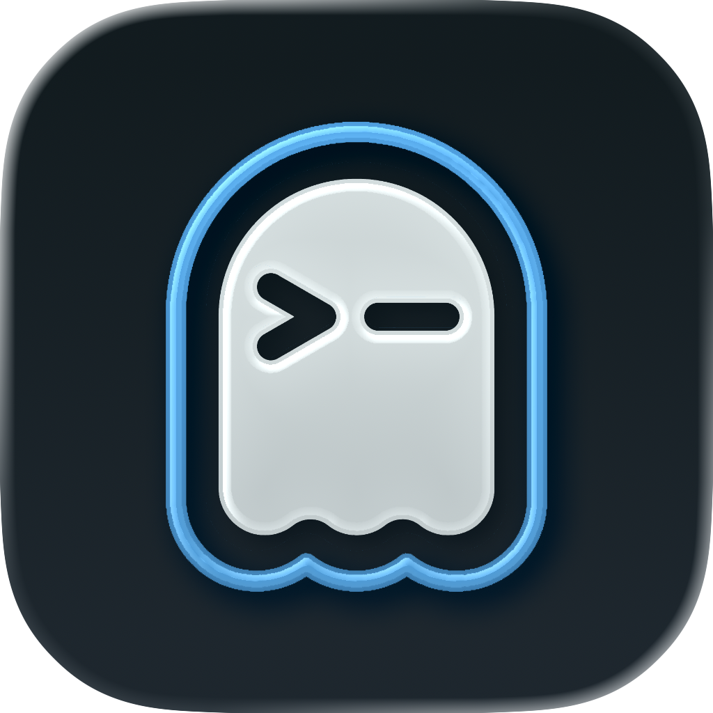
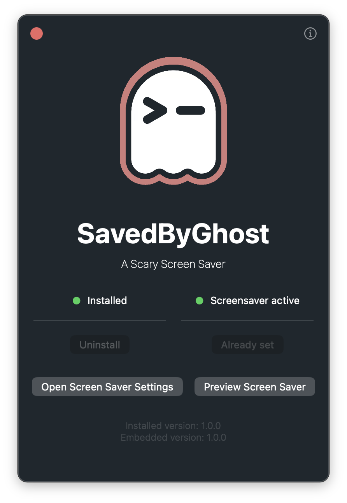
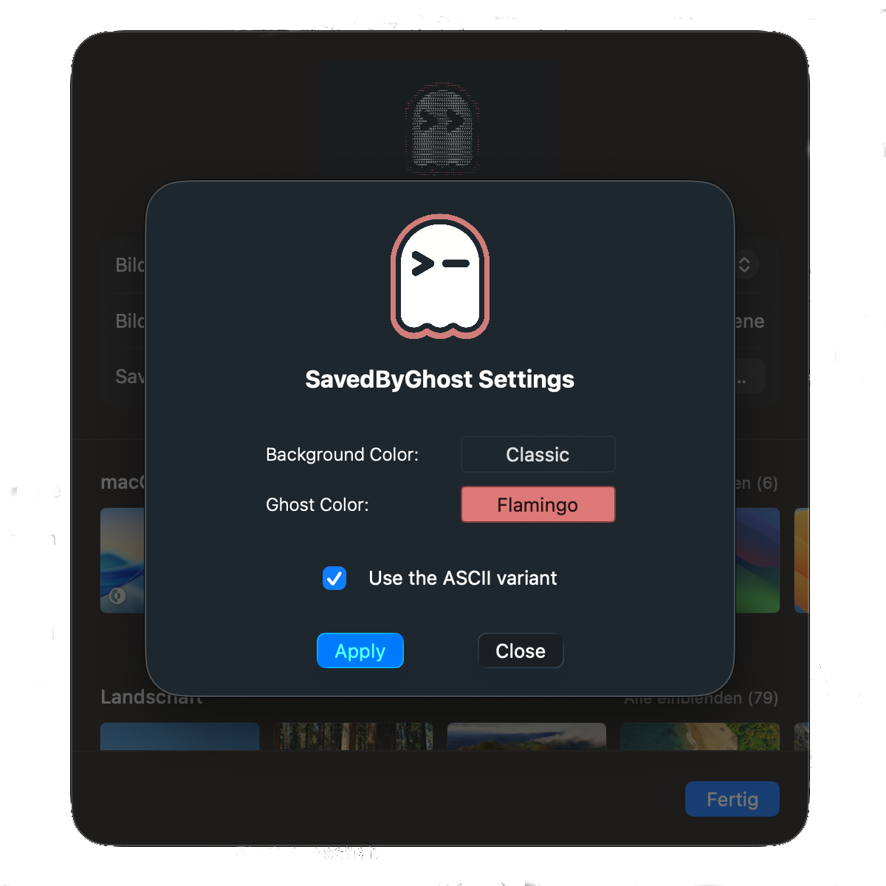

   
   
   
  
   
   
   

#  SavedByGhost 👻 - A Scary Screen Saver

This project contains a little screen saver for macOS based on the lovely animation from Ghostty, written in Swift, Objective-C, C and C++.

   
  
  
   

## Features

- A palette of usable background colors
- A palette of usable colors for the Ghost outline
- Switching between an ASCII animation and a regular animation

## How do I get it?

Because the project creates an App Extension (.appex) and shares state with the main application, it uses App Groups and must be signed. I do not have a paid Apple developer account (yet), therefore you must build the project from source. Xcode will ensure you have all dependencies available.

1. Clone the repository: `git clone https://codeberg.org/philippremy/SavedByGhost.git`
2. (Optional) Checkout a specific release `git checkout v1.0.0`
3. Open the Xcode Project file `SavedByGhost.xcodeproj`
4. Build from the IDE

Alternatively you can build it from the command line with `xcodebuild`, but make sure to set your Signing Identity in Xcode first!

## FAQ

### I launched the App but no window showed up

The app is a status/menu-bar-only app - meaning that it does not launch a full fledged window and no Dock icon becomes visible. Just look out for a little Ghost 👻 icon in your menu bar. If you click that, a small utility window will open. Generally speaking, there is no advantage of keeping the App open after you installed the screen saver through it.

### Where can I configure the Screen Saver?

The configuration for the Screen Saver does not happen in the App itself, instead Apple provides a way to directly integrate a configuration sheet into the System Settings. Because you'll generally be around that configuring/changing screen savers, I opted to use it and move the configuration to there. You can access it under `Wallpaper -> Screen Savers -> (Make sure SavedByGhost is selected) -> Options`.

### Does it track any information?

No. This app does not track any information and does not even connect to the internet. If you do not believe me, read through the source code yourself!

### Does it clutter my hard drive with assets?

No (depending on what you define as clutter). Because macOS cannot play a video file from in-memory data, the App will extract a video file into its Application Support folder. The same goes for a specific Font which it requires to render the ASCII art. The assets have the following size:

- `SavedByGhostVideo.mp4`: 3.8 MB
- `SavedByGhostFont.ttf`: 40 KB

So while it is not exactly *much* data, it still is data. But the App itself is only about 12 MB (for a dual architecture build), which sits nicely between other Apple-provided system apps.

### Will it drain my battery?

Not really. Playing the video-only version of the Screen Saver uses around 6-9% of one efficiency core of the CPU. The ASCII version comes in slightly higher at around 15-18%. But that is well in the range for what it is doing behind the scenes (nothing is free of course) and it sits nicely between other screen savers (Apple's own screen savers can have much higher CPU demands at times).

### I notice some delay at startup

That is expected and prevents expensive recomputation. When the screen saver starts (either in Preview or as an actual screen saver), it will prerender the ASCII frames ahead of time. This can take a second or two, depending on your hardware. Just be a little patient and it should start right after the processing is done. The same applies of course when you change the background or foreground color or switch between ASCII and video mode.

### Why can't I use custom colors?

Because I didn't want to implement it for now. Go ahead, fork and do it yourself. Maybe I'll add it at some point, maybe not.

### Why is the ASCII parsing algorithm so bad?

Because I just whipped something together (technically in C) just to get something working :). But because parsing is cached once done, it does not really matter that much.

### Why on Codeberg?

Because GitHub won't give me any money for training their AI models (if you need GitHub support, the project is mirrored to https://github.com/philippremy/SavedByGhost. Contributions of any kind need to be done through Codeberg though!).

### But you clearly used AI?

Yes. The general concept and implementation was written by hand, however. AI becomes super helpful when an Apple helper thread of AVFoundation randomly crashes and there is basically no backtrace to inspect.

### What about licensing?

First and foremost: FOSS is probably the greates thing for software development out there. That is why this project is licensed under GPL-3.0. If you change something, please give it back to the community. I won't make money with this and neither will you :D.

Second: The following third-party projects are used:

- PaperSaver (by Aerial) 0.2.1: MIT (https://github.com/AerialScreensaver/PaperSaver)
- swift-argument-parser (by Apple) 1.8.2: Apache-2.0 (https://github.com/apple/swift-argument-parser)
- swift-collections (by Apple) 1.6.0: Apache-2.0 (https://github.com/apple/swift-collections)

Third: The following third-party assets are used:

- Ghost Video Animation (by Ghostty): MIT (https://github.com/ghostty-org/website)
- Iosevka Font (by Belleve/be5invis): OFL-1.1 (https://github.com/be5invis/Iosevka)

The thumbnails and app icon are made by me (that's why they're ugly). The icon for the `NSStatusItem` is an extracted and decolored frame from the Ghost Video Animation.

### It crashed :(

Sorry to hear that, please submit an issue, ideally with your crash log from `Console.app` attatched. In the meantime just try to restart :D.

